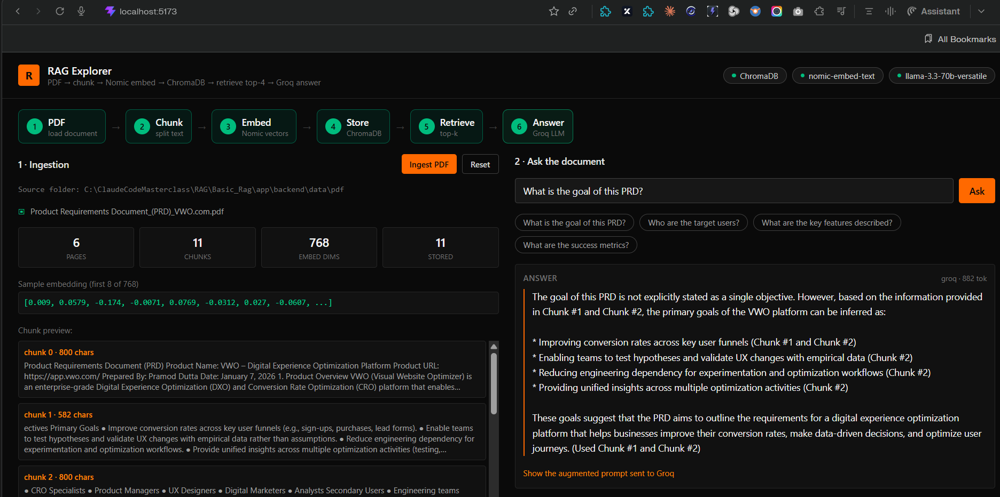

# RAG Explorer

Visual walkthrough of a full RAG pipeline: PDF/TXT/MD/Excel → chunk → embed (Nomic) → ChromaDB → query → top-4 retrieval → Groq LLM answer.



## Live

- **Frontend:** https://frontend-six-alpha-35.vercel.app (Vercel)
- **Backend:** currently exposed via Cloudflare Tunnel from a local machine — **only reachable while that machine + tunnel process are running.** Not an always-on deploy. See [Deploying the backend](#deploying-the-backend-always-on) below for the real hosting path.

## Run

**Backend** (FastAPI, port 8000)
```
cd backend
python -m venv .venv
.venv\Scripts\activate
pip install -r requirements.txt
copy .env.example .env   # then paste your GROQ_API_KEY
uvicorn main:app --reload --port 8000
```

Drop any PDF into `backend/data/pdf/` — it auto-ingests (watchdog watches the folder; also ingests on startup). A sample PDF is already there.

**Frontend** (Vite dev server, port 5173)
```
cd frontend
npm install
npm run dev
```

Open http://localhost:5173.

## Notes

- Embedding model: `nomic-ai/nomic-embed-text-v1.5` via `sentence-transformers`, runs fully local — no Nomic API key needed. First run downloads the model (~500MB).
- Vector DB: ChromaDB, persisted to `backend/chroma_db/`.
- LLM: Groq, `llama-3.3-70b-versatile` (real model — spec's "OpenGPT 1.2 120B" isn't a Groq model; swap `GROQ_MODEL` in `.env` if you want `openai/gpt-oss-120b` instead).
- Without a `GROQ_API_KEY`, retrieval still works — the answer panel shows a placeholder instead of a generated response.
- Ingestion supports PDF, TXT, Markdown, and Excel (`.xlsx`/`.xls`) — drop any of these into `backend/data/pdf/` and they auto-ingest. Manual upload button in the UI works the same way.

## Deploying the backend (always-on)

This backend needs **real RAM** to run — `sentence_transformers` (torch) + the
local embedding model don't fit Render's free tier (512MB). Confirmed by
testing: the free-tier process crash-looped every ~7 minutes, killed
mid-download of the model weights, before ever finishing startup.

Two real options, in order of effort:

1. **Pay for enough RAM.** Render Starter ($7/mo, 2GB) is the path of least
   resistance — `backend/render.yaml` is already written for this, no code
   changes needed. Fly.io / Railway are alternatives but have their own
   free-tier RAM ceilings that likely hit the same wall untested.
2. **Swap the embedding approach** to something that fits a free tier —
   replace local `sentence-transformers` with a hosted embedding API call
   (adds an external dependency, changes the "fully local embedding" design
   this project intentionally started with), or a much smaller local model.

Neither is done yet. Current live setup (Vercel frontend + Cloudflare
Tunnel backend) is a **demo-only** stopgap — good for showing the pipeline
working right now, not for a permanent public link.

### What's already prepared for a real deploy

- `backend/render.yaml` — Render Blueprint, root dir + build/start commands
  + env var placeholders already set.
- `backend/Dockerfile` + `.dockerignore` — written for the Hugging Face
  Spaces attempt (abandoned: Docker/Gradio Spaces require HF Pro, $9/mo,
  not actually free as initially assumed). Reusable for any Docker-based
  host if that's ever preferred over Render's native Python runtime.
- `frontend/src/api.js` reads `VITE_API_URL` at build time — set that env
  var on Vercel to whatever the real backend URL ends up being, then
  redeploy (`vercel deploy --prod`) to bake it into the bundle.
- CORS is controlled by `CORS_ORIGINS` in the backend's env (comma-separated
  list); defaults to `*` if unset — tighten it to the real frontend URL once
  it's stable.
